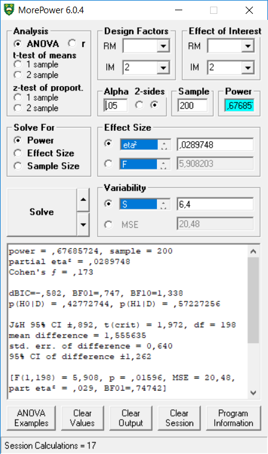

# Appendix 2: Direct Comparison to MOREpower {-}

MOREpower 6.0 by @Campbell2012MorePower6F is standalone software for power analysis for ANOVA, t-tests, correlations, and tests of proportions. It outperforms Gpower, in that it allows researchers to perform power analyses for a much wider range of designs. It allows a maximum of 9 levels per factor. Users can solve for N, power or effect size. An ANOVA effect size may be specified in terms of the effect-related variance explained (partial eta-squared) or in terms of a test statistic (*F*, mean square treatment [MST], or *t*). 

Compared to `Superpower`, it does not provide all tests at once, it does not provide simple comparisons, it does not incorporate corrections for multiple comparisons, and it does not allow users to enter the means, sd's, and correlations. 

We can replicate the independent *t*-test example in MOREpower:

```{r}
string <- "2b"
n <- 100
mu <- c(24, 26.2)
sd <- 6.4
labelnames <- c("condition", "control", "pet") #
# the label names should be in the order of the means specified above.
design_result <- ANOVA_design(design = string,
                              n = n,
                              mu = mu,
                              sd = sd,
                              labelnames = labelnames)
alpha_level <- 0.05

exact_result <- ANOVA_exact(design_result,
                            alpha_level = alpha_level,
                            verbose = TRUE)

exact_result$main_result$partial_eta_squared
exact_result$main_result$power
```





We see the power estimates almost perfectly align with MOREpower if we enter partial eta-squared of 0.02897482, sample = 200 (MOREpower requires entering the total N, not N per condition).

We can also replicate the dependent *t*-test example in MOREpower.

```{r}
K <- 2
n <- 34
sd <- 1
r <- 0.5
alpha = 0.05
f <- 0.25
f2 <- f^2
ES <- f2/(f2 + 1)
ES

mu <- mu_from_ES(K = K, ES = ES)
design = paste(K,"w",sep = "")
labelnames <- c("speed", "fast", "slow")

design_result <- ANOVA_design(design = design,
                   n = n, 
                   mu = mu, 
                   sd = sd, 
                   r = r, 
                   labelnames = labelnames)

alpha_level <- 0.05

exact_result <- ANOVA_exact(design_result,
                            alpha_level = alpha_level,
                            verbose = TRUE)
exact_result$main_result$partial_eta_squared
exact_result$main_result$power
```


We can also replicate the 3-group within ANOVA example in MOREpower.

```{r}
K <- 3
n <- 20
sd <- 1
r <- 0.8
alpha = 0.05
f <- 0.25
f2 <- f^2
ES <- f2 / (f2 + 1)
ES

mu <- mu_from_ES(K = K, ES = ES)

design = paste(K, "w", sep = "")
labelnames <- c("speed", "fast", "medium", "slow")
design_result <- ANOVA_design(design = design,
                   n = n, 
                   mu = mu, 
                   sd = sd, 
                   r = r, 
                   labelnames = labelnames)

alpha_level <- 0.05

exact_result <- ANOVA_exact(design_result,
                            alpha_level = alpha_level,
                            verbose = TRUE)

#MSE, for MOREpower
exact_result[["aov_result"]][["anova_table"]]

#POWER
exact_result$main_result$power
```


We can reproduce the 2x2 ANOVA example in MOREpower.

```{r}
mu = c(700, 670, 670, 700) 
sigma = 150  # population standard deviation
n <- 25
sd <- 150
r <- 0.75
string = "2w*2w"
alpha_level <- 0.05
labelnames = c("age", "old", "young", "color", "blue", "red")
design_result <- ANOVA_design(design = string,
                              n = n, 
                              mu = mu, 
                              sd = sd, 
                              r = r, 
                              labelnames = labelnames)

simulation_result <- ANOVA_exact(design_result, 
                                 alpha_level = alpha_level, 
                                 verbose = TRUE)

simulation_result$main_result$partial_eta_squared[3]
```

This result reproduces the analysis in MOREpower, for a 2x2 within design, with a sample of 25, and eta-squared of 0.1428571.


Let's replicate the 2x2x2 full between analysis (total N = 400, effects sizes differ for each test):

```{r}
# With 2x2x2 designs,
# the names for paired comparisons can become very long.
# So here I abbreviate terms:
# Size, Color, and Cognitive Load, have values:
# b = big, s = small, g = green,
# r = red, pres = present, abs = absent.
labelnames <- c("Size", "b", "s", "Color", "g", "r",
                "Load", "pres", "abs") #
design_result <- ANOVA_design(design = "2b*2b*2b",
                              #sample size per group
                              n = 50,
                              #pattern of means
                              mu = c(2, 2, 6, 1, 6, 6, 1, 8),
                              sd = 10, #standard deviation
                              labelnames = labelnames)

exact_result <- ANOVA_exact(design_result,
                            alpha_level = alpha_level,
                            verbose = TRUE)

exact_result$main_result$partial_eta_squared

```

This result is nicely reproduced in MOREpower, both for the 2x2 effects, and the 2x2x2 between effects.


And finally, let's replicate the 2x2 full within analysis.

```{r}
mu = c(2,1,4,2)
n <- 20
sd <- 5
r <- c(
  0.8, 0.5, 0.4,
  0.4, 0.5,
  0.8
)
string = "2w*2w"
labelnames = c("A", "a1", "a2", "B", "b1", "b2")
design_result <- ANOVA_design(design = string,
                              n = n,
                              mu = mu,
                              sd = sd,
                              r = r,
                              labelnames = labelnames)
exact_result <- ANOVA_exact(design_result,
                            alpha_level = alpha_level,
                            verbose = TRUE)

exact_result$main_result$partial_eta_squared
exact_result$main_result$power

```

This result is also reproduced in MOREpower, both for the main effect, and the 2x2 within interaction effect.


